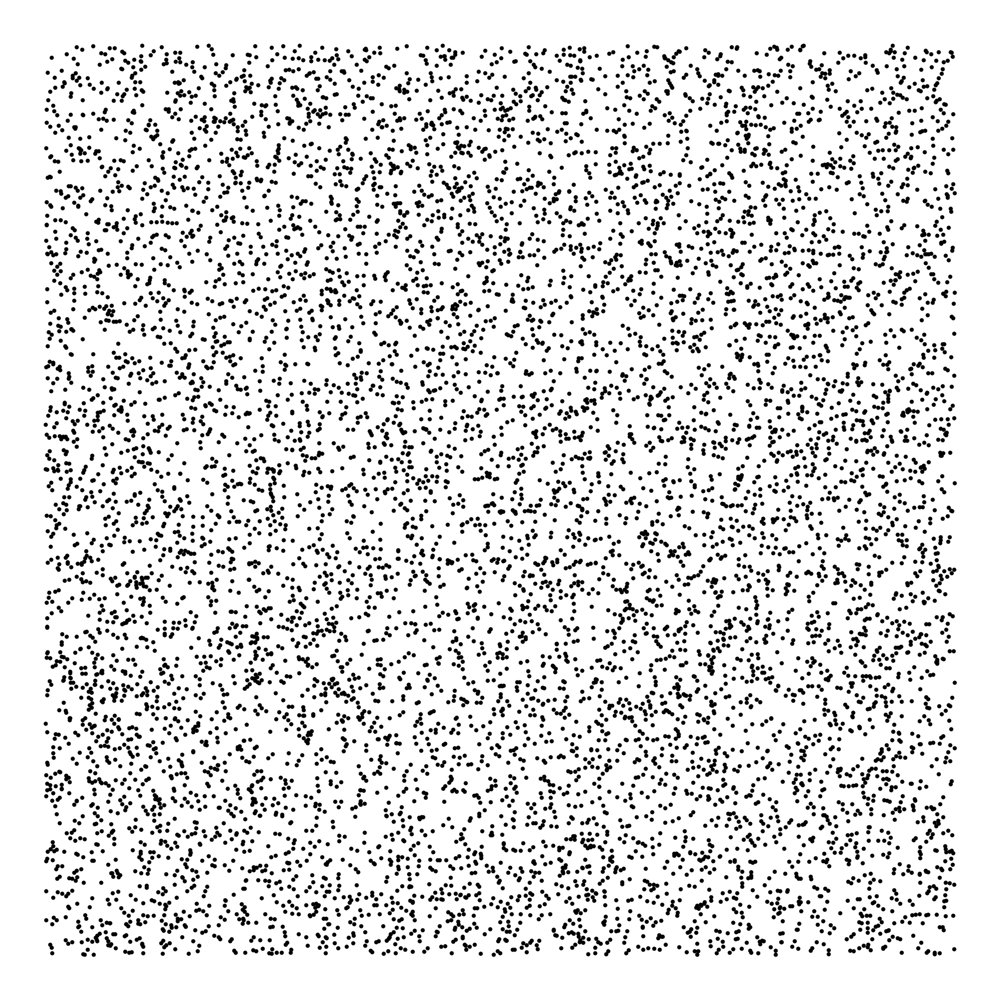
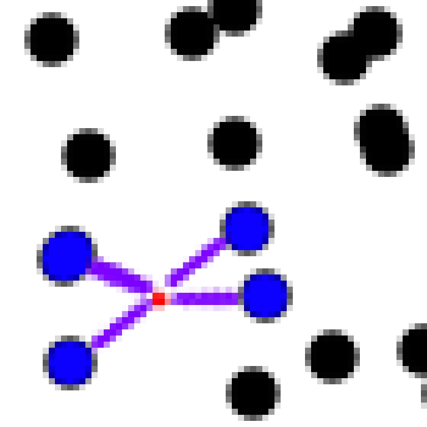

# Nearest Points

## 最近的点

**EN**: I will give you $n$ points, each point has a coordinate $(x, y)$. Then I will provide you an arbitrary coordinate $(x_0, y_0)$, what you need to do is to find the nearest $k$ points to $(x_0, y_0)$, as fast as possible.

**ZH**: 我会给你 $n$ 个点，每个点都有一个坐标 $(x, y)$ 。然后我会给你一个任意的坐标 $(x_0, y_0)$ ，你需要尽力最快找到离 $(x_0, y_0)$ 最近的 $k$ 个点。

**Tip**: The arbitrary coordinate $(x_0, y_0)$ *may* not in the $n$ points.

